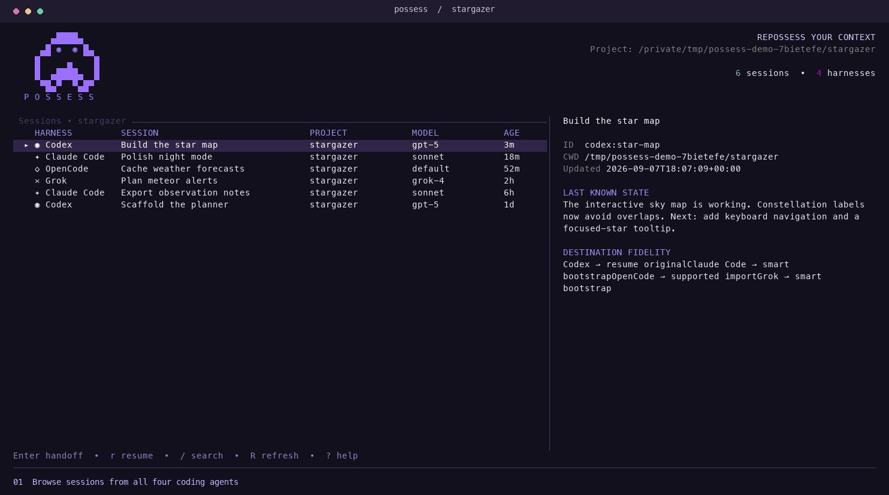

# Possess

```text
       ▄████▄
     ▄█ ◉  ◉ █▄     P O S S E S S
    █     ▄    █    repossess your context
    █  ▄████▄  █
     ▀█▄▀  ▀▄█▀
```

Switch coding agents without starting the conversation over.

CD to your project repo, run `possess`, pick a session, and resume or choose which agent should take over.



Possess works with **Codex, Claude Code,
OpenCode, and Grok**.

## Install

You'll need macOS or Linux, Git, and Rust 1.92+. Install and log into whichever
coding harnesses you want to use first.

```bash
git clone https://github.com/steven-p-walsh/Possess.git
cd Possess
cargo install --path . --locked
possess
```

If your shell can't find `possess`, check that `~/.cargo/bin` is on your `PATH`.
See the [installation guide](docs/installation.md) for setup help, release
archives, and upgrades.

## Using it

Launch Possess from your project directory. It shows sessions for that project,
including ones started from subdirectories of the same Git repo. Outside Git,
it uses the current directory. Run `possess --all-projects` to see everything.

Select a session to see where you left off, then press `Enter` to choose a harness.
Choose the same harness and it just resumes the original session. Choose another
and you can pick a model and agent before handing over. When the harness exits,
you're back in Possess.

Claude's model list picks up your settings and recently used models, with Fable,
Opus, Sonnet, and Haiku as fallbacks. You can also enter a model name yourself.

| Key | Action |
| --- | --- |
| Arrows or `j` / `k` | Move through sessions |
| `/` | Search |
| `Enter` | Choose a harness to continue in |
| `r` | Resume with the original harness |
| `R` | Refresh the list |
| `?` | All shortcuts |
| `q` | Quit |

If a harness or its sessions aren't showing up, run `possess doctor` to check
what was detected. You can set custom paths in `~/.config/possess/config.toml`;
the [setup guide](docs/installation.md#verify-the-installation) has an example.

## What comes along

Possess saves the conversation, tool calls and results, plans, and Git state in
a local handoff package. Your project stays in place, and the original session
stays available.

The harnesses don't share a session format. Possess imports history where it
can; otherwise it starts the new agent with a handoff prompt built around recent
work, open tasks, and errors. The saved history is there if the agent needs more
detail. Which path you get depends on the harness and version; the
[compatibility notes](docs/compatibility.md) cover that.

Handoffs live in `~/.local/share/possess` (or `POSSESS_HOME`). They can contain
private conversation and code, so keep them out of your repo. Possess doesn't
need API keys of its own; each harness uses its existing login.

## From the command line

You can also skip the picker. Use a session ID from `possess list`:

```bash
possess list
possess list --all-projects
possess show SESSION_ID
possess handoff SESSION_ID --to codex
possess resume SESSION_ID
```

Add `--model` or `--agent` to a handoff to choose either explicitly.
`--no-launch` prepares the handoff without starting the destination harness.
For the same harness, it only prepares a resume command; no package is created.
Run `possess handoff --help` for the rest.

## Working on Possess

```bash
cargo fmt --check
cargo clippy --all-targets --all-features -- -D warnings
cargo test
```

The [architecture notes](docs/architecture.md) explain how discovery and
handoffs work. [CONTRIBUTING.md](CONTRIBUTING.md) covers adapter changes and
comments: explain the reason for the code, not what the next line does.
