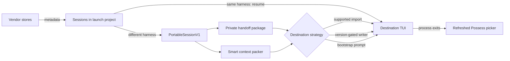

# Architecture

Possess treats a coding session as three related things: vendor-owned source state, a
portable archive, and the smaller context a destination model can use immediately. They
stay separate because each has a different stability and size requirement.

## Read path

The launch directory determines the project: the Git working-tree root when available,
otherwise the current directory. Session paths are resolved through symlinks and matched
by path components; nested repositories and other worktrees stay separate. The scope is
captured at startup and applied to every scan and CLI lookup. `--all-projects` opts out.

Adapters discover lightweight metadata first. Codex and OpenCode use local indexes;
Claude reads a bounded transcript tail; Grok reads per-session summaries. Full history is
parsed only after a session is selected. JSONL parsing stops at the last complete newline
so an active harness can keep writing while Possess takes a coherent snapshot.

The portable model keeps user and assistant messages, tool calls and results, summaries,
errors, todos, attachments, and repository state. Tool names are also mapped to a small
operation vocabulary. Unknown tools remain `other` because guessing that a vendor tool is
safe to replay would give it stronger meaning than its source record provides.

## Package path

Every transfer publishes `handoffs/<uuid>` with one final rename. A crash can leave a
hidden temporary directory, but cannot expose a half-written directory as a completed
handoff. The package contains the normalized session, the destination prompt, a manifest,
and a generated OpenCode import when needed.

Sanitized source records are compressed into content-addressed blobs. Their hash makes
repeat snapshots cheap and lets future tooling verify provenance. Authentication stores,
lock files, vendor system prompts, and encrypted reasoning are excluded. Unix directories
use mode `0700`; files use `0600`.

OpenCode is the exception to raw-source capture because one SQLite database contains every
session. Copying that database into one handoff would include unrelated conversations, so
its scoped normalized session and generated importer are archived instead.

The archive can still contain credentials that a user pasted into ordinary conversation or
tool output. The sensitivity scanner records category counts in the manifest without
copying matched values into diagnostics. This is why the entire Possess data directory is
private and kept outside repositories.

## Context path

The smart context packer reserves room for identity, Git state, active todos, compacted
summaries, and a continuation instruction. It then spends the remaining budget on recent
events and restores chronological order before launch. Tool output is labeled as historical
data so text copied from a previous tool cannot silently become a new instruction.

The complete archive path is included in the prompt. A destination can inspect older detail
when it matters instead of paying for all of it in the first request.

## Launch path

Choosing the source harness returns a native resume command before loading history or
creating a package. The existing session ID is kept, and the harness owns the continuation.
The picker skips the remaining wizard steps for this path.

When changing harnesses, Possess uses a supported importer or a private writer with an
exact or narrow version gate. Everything else receives the smart bootstrap prompt as the
first interactive message.

The TUI leaves raw mode and the alternate screen before starting a destination process.
The child harness therefore owns the terminal normally. When it exits, Possess restores
its screen and rescans all stores, which makes repeated handoffs possible without opening a
second terminal.
